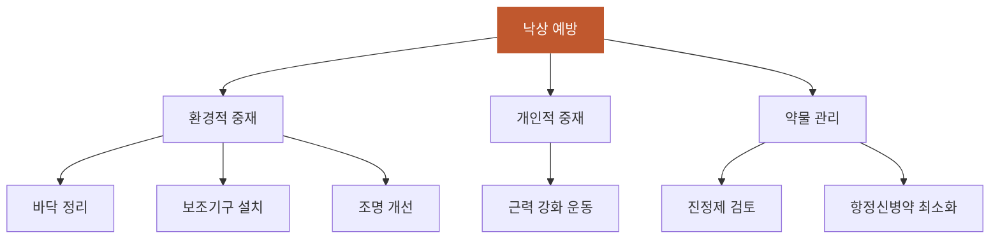

# 낙상예방

## 핵심 내용

# 낙상 예방 (Fall Prevention)

## 핵심 개념

### 3-3. 낙상 예방

치매 환자의 낙상 위험은 일반 노인의 2~3배이다:
- 환경 정리: 미끄러운 바닥, 문턱, 전선 제거
- 보조기구: 손잡이, 안전바, 미끄럼 방지 매트
- 근력 강화: 규칙적 운동 프로그램
- 약물 검토: 진정제, 항정신병약 등 낙상 위험 약물 최소화
- 조명 개선: 특히 야간 이동 경로

## 핵심 키워드

낙상예방, 낙상 예방, Fall Prevention


# 낙상 예방 (Fall Prevention) - 간호 교육용 통합 학습 파일

## 체크리스트

□ C1: 치매환자 낙상위험 정도 설명
□ C2: 환경적 낙상예방 중재방법
□ C3: 개인적 낙상예방 중재방법  
□ C4: 낙상위험 증가 약물종류
□ C5: 임상 적용 — "이 환자에게 위 개념을 적용하여 판단/설명"

체크 규칙:
- 학습자가 해당 개념을 "자기 말로" 표현하면 체크
- 교재 문장을 그대로 반복하는 것은 체크 안 함
- 한 턴에 여러 항목이 동시에 체크될 수 있음

## 교수 전략

### PS-I 첫 사례

> 김철수(78세) 환자는 알츠하이머 치매 진단을 받은 지 2년이 되었습니다. 최근 3개월간 집에서 2회 넘어졌고, 보호자인 아들이 "아버지가 밤에 화장실 가다가 자주 비틀거리고 넘어질까 봐 걱정된다"며 상담을 요청했습니다. 환자는 현재 수면제와 항정신병 약물을 복용 중입니다.

이 사례를 제시하고 학습자에게 물어보세요:
- "김철수 환자의 낙상 위험도는 일반 노인과 비교해서 어떨까요? 그 이유는 무엇인가요?"

### 체크리스트별 교수 힌트

**C1 유도:**
- "치매 환자의 낙상 위험은 일반 노인과 비교했을 때 어느 정도인가요?"

**C2 유도:**
- "김철수 환자의 집 환경에서 어떤 것들을 점검하고 개선해야 할까요?"

**C3 유도:**
- "환경 개선 외에 김철수 환자 개인에게 적용할 수 있는 낙상 예방법은 무엇이 있을까요?"

**C4 유도:**
- "김철수 환자가 복용 중인 약물들이 낙상에 어떤 영향을 미칠 수 있을까요?"

**C5 (임상 적용):**
- C1~C4를 배운 후: "김철수 환자와 가족에게 종합적인 낙상 예방 교육 계획을 세워보세요."

## 자료



```tip
• 치매 환자의 낙상 위험은 일반 노인의 2~3배로 매우 높음
• 환경 정리(바닥, 문턱, 전선), 보조기구 설치, 조명 개선이 핵심
• 약물 검토를 통한 낙상 위험 약물 최소화가 중요함
```
