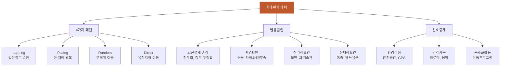

# 배회

## 핵심 내용

# 배회 (Wandering)

## 핵심 개념

- 초조와 초조로 치매 진단 의뢰, 기억의 장기적 저하와 사사로운 것을 자주 잊어버리는 양상
- 집안에서 계속 돌아다니며 의미 없이 문을 여닫음
- MMSE 10/30, CPCOG에서 의미있는 변화 확인

## Chapter 5. 치매에서의 배회 (Wandering in Dementia)

### 케이스 (74세 여성)
- 초조와 초조로 치매 진단 의뢰, 기억의 장기적 저하와 사사로운 것을 자주 잊어버리는 양상
- 집안에서 계속 돌아다니며 의미 없이 문을 여닫음
- MMSE 10/30, CPCOG에서 의미있는 변화 확인

### 정의
- 배회(wandering): 목적 없어 보이는 반복적·과도한 걷기/이동
- 치매 환자 배회 유병률: 연구에 따라 다양하나 평균 63% 정도

### 역학 (Epidemiology)
- 배회는 lapping(구간 반복), pacing(왕복), random(무작위), direct(목적지향) 4가지 패턴
- 지역사회 거주 치매 환자: 약 17~63%
- 시설 거주 환자: 더 높은 비율

### 배회의 원인 (Cause of Wandering)
- 뇌신경계 손상: 기저핵, 전두엽, 두정엽, 해마 등 관련
- 환경 요인: 익숙하지 않은 환경, 소음, 자극 과잉/부족
- 심리적 요인: 불안, 지루함, 과거 습관(예: 직업적 습관)
- 신체적 요인: 통증, 배뇨 욕구, 공복감

### 배회의 분류와 해부학적 위치 (Classification)
- **Lapping**: 같은 경로를 반복적으로 순환 → 전두엽-두정엽 관련
- **Pacing**: 한 지점에서 왕복 → pacing은 비교적 단순한 운동 패턴
- **Random**: 무작위 방향 이동 → 시공간 능력 저하와 관련
- **Direct**: 특정 목적지 향해 이동 → 과거 습관, 귀가 욕구
- 해부학적으로: PDG-PET 연구에서 배회 환자는 좌측 측두-두정엽 부위(temporoparietal) 대사 저하가 더 현저
- SPECT(단일광자방출전산화단층촬영): 배회 환자에서 좌측 측두엽 혈류 저하

### 배회와 관련된 치매의 특성 (Dementia Associated with Wandering)
- 배회 환자: MMSE 및 CDR에서 더 심한 인지기능 저하
- pacing 환자 비율이 더 높으면 전반적 인지 손상이 심함
- Cooper 등: 배회 유무와 교육수준 간 관련성 없음

### 배회와 연관 신경행동증상 (Neurobehavior Symptoms Associated with Wandering)
- 배회 환자에서 수면장애, 식욕 문제, 초조, 공격성 등 다른 신경행동증상 동반 빈도 높음
- 특히 초조·공격성과 높은 상관

### 배회의 검사 (Test of Wandering)
- **Revised Algase Wandering Scale (RAWS)**: 배회 평가 표준 도구
- 배회 시간, 빈도, 패턴 등 기록

### 배회의 예후 (Prognosis)
- 배회 증상: 치료기관 시설 입소의 주요 원인 중 하나
- Nursing Home 입소 시기를 앞당기는 요인
- 낙상, 골절, 길 잃음, 저체온증, 탈수 등 위험 증가

### 배회의 치료 (Treatment of Wandering)
- **비약물적 치료 우선**
- (1) 환경 수정: 안전한 배회 공간 확보, 출입구 잠금장치, GPS/위치추적
- (2) 감각자극: 아로마테라피, 음악, massage with touch therapy
- (3) 구조화된 활동: 야외활동(outdoor walking), 운동 프로그램
- (4) 의사소통: 배회 원인(통증, 불안, 배뇨 등) 파악 후 대응
- (5) 리다이렉션: 배회 행동을 안전한 다른 활동으로 유도
- (6) 약물: 초조 동반 시 최소 용량, 단기간
- (7) 기술적 개입: 전자감시 시스템, 센서

---


## 핵심 키워드

배회, 배회, Wandering


# 치매 환자의 배회 — 간호 교육용 통합 학습 파일

## 체크리스트

□ C1: 배회의 정의와 치매환자에서의 특징 설명하기
□ C2: 배회의 4가지 패턴별 특성과 관련 뇌 부위 구분하기  
□ C3: 배회와 다른 신경행동증상의 차이점 설명하기
□ C4: 배회 발생 원인과 위험요인 분석하기
□ C5: 임상 적용 — "이 환자에게 위 개념을 적용하여 판단/설명"

체크 규칙:
- 학습자가 해당 개념을 "자기 말로" 표현하면 체크
- 교재 문장을 그대로 반복하는 것은 체크 안 함
- 한 턴에 여러 항목이 동시에 체크될 수 있음

## 교수 전략

### PS-I 첫 사례

> 김○○ 할머니(78세)가 중등도 치매로 요양원에 입소하셨습니다. 밤낮으로 복도를 계속 걸어다니며, 같은 경로를 반복적으로 돌고 있습니다. 가족은 "집에 있을 때도 하루 종일 집 안을 돌아다니며 문을 열었다 닫았다 하셨어요. 넘어질까봐 걱정이에요"라고 호소합니다. MMSE 점수는 12점입니다.

이 사례를 제시하고 학습자에게 물어보세요:
- "이 할머니가 보이는 행동의 특징은 무엇이며, 어떤 간호 문제로 볼 수 있을까요?"

### 체크리스트별 교수 힌트

**C1 유도:**
- "치매 환자에게서 나타나는 '목적 없어 보이는 반복적 걷기'를 뭐라고 하나요? 이것이 단순한 산책과 다른 점은 무엇인가요?"

**C2 유도:**
- "할머니가 '같은 경로를 반복적으로 도는' 행동은 배회의 어떤 패턴에 해당할까요? 각 패턴별 특징을 설명해보세요."

**C3 유도:**
- "배회와 함께 자주 나타나는 다른 증상들은 무엇이 있나요? 배회가 단독으로 나타나는 경우와 어떻게 구별하나요?"

**C4 유도:**
- "이 할머니의 배회 행동이 나타나는 원인을 뇌 손상, 환경적, 심리적, 신체적 요인으로 나누어 분석해보세요."

**C5 (임상 적용):**
- C1~C4를 배운 후: "이 할머니에게 우선적으로 적용할 비약물적 간호중재 3가지를 배회의 원인과 연결하여 계획해보세요."

## 자료



```tip
💡 배회는 치매환자의 63%에서 나타나는 흔한 증상으로, 4가지 패턴(lapping, pacing, random, direct)으로 구분됩니다.
💡 측두-두정엽 손상과 관련이 깊으며, 초조·공격성 등 다른 신경행동증상과 함께 나타나는 경우가 많습니다.
💡 비약물적 치료가 우선이며, 환경수정과 구조화된 활동을 통해 안전한 배회 환경을 제공하는 것이 핵심입니다.
```
