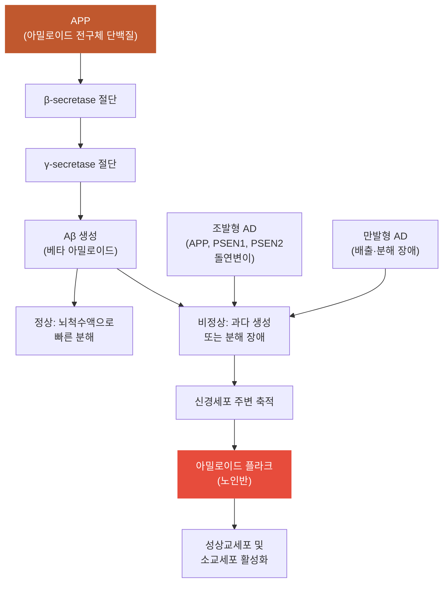

# 아밀로이드_플라크

## 핵심 내용

# 아밀로이드 플라크 (Amyloid Plaque)

## 핵심 개념

## 1. 분자·세포 수준의 병태생리

### 1-1. 아밀로이드 연쇄 가설 (Amyloid Cascade Hypothesis)

베타 아밀로이드(Aβ) 단백질은 정상적으로도 소량 생성되며 뇌척수액에 의해 빠르게 분해된다. 그러나 비정상적으로 과다 생성되면 분해되지 않고 신경세포 주변에 쌓여 플라크(plaque)를 형성한다. 이 플라크가 노인반(senile plaque)의 핵심 구성 요소이다.

아밀로이드 연쇄 가설의 핵심 경로는 다음과 같다:
- APP(아밀로이드 전구체 단백질) → β-secretase, γ-secretase에 의해 절단 → Aβ 생성
- 조발형(early-onset) 가족성 AD: APP, PSEN1, PSEN2 유전자 돌연변이 → Aβ 과다 생성
- 만발형(late-onset): Aβ 배출·분해 장애 → 축적

## 1. 분자·세포 수준의 병태생리

### 1-1. 아밀로이드 연쇄 가설 (Amyloid Cascade Hypothesis)

베타 아밀로이드(Aβ) 단백질은 정상적으로도 소량 생성되며 뇌척수액에 의해 빠르게 분해된다. 그러나 비정상적으로 과다 생성되면 분해되지 않고 신경세포 주변에 쌓여 플라크(plaque)를 형성한다. 이 플라크가 노인반(senile plaque)의 핵심 구성 요소이다.

아밀로이드 연쇄 가설의 핵심 경로는 다음과 같다:
- APP(아밀로이드 전구체 단백질) → β-secretase, γ-secretase에 의해 절단 → Aβ 생성
- 조발형(early-onset) 가족성 AD: APP, PSEN1, PSEN2 유전자 돌연변이 → Aβ 과다 생성
- 만발형(late-onset): Aβ 배출·분해 장애 → 축적
- Aβ 플라크는 증상 발현 10~15년 전부터 침적되기 시작한다

Chen et al.(2020)은 Aβ 플라크가 뇌 신경조직에 축적되면 성상교세포(astrocyte)와 소교세포(microglia)에 직접 영향을 미쳐 다세포 유전자의 공동 발현을 유도한다는 사실을 밝혔다.

## 핵심 키워드

아밀로이드, 플라크, 아밀로이드 플라크, Amyloid Plaque


# 아밀로이드 플라크 (Amyloid Plaque) 통합 학습 파일

## 체크리스트

□ C1: 아밀로이드 플라크의 정의와 구성 요소
□ C2: 베타 아밀로이드(Aβ)의 정상 vs 비정상 과정
□ C3: 조발형과 만발형 알츠하이머병의 발생 기전 차이
□ C4: APP에서 Aβ 생성까지의 분자적 경로
□ C5: 임상 적용 — "이 환자에게 위 개념을 적용하여 판단/설명"

체크 규칙:
- 학습자가 해당 개념을 "자기 말로" 표현하면 체크
- 교재 문장을 그대로 반복하는 것은 체크 안 함
- 한 턴에 여러 항목이 동시에 체크될 수 있음

## 교수 전략

### PS-I 첫 사례

> 김○○씨(74세)가 최근 2년간 점진적인 기억력 저하로 신경과 외래를 방문했습니다. 딸은 "어머니가 같은 말을 계속 반복하시고, 며칠 전 일도 기억하지 못해요"라고 호소했습니다. PET-CT 검사에서 뇌 조직 내 아밀로이드 플라크 침착이 광범위하게 관찰되었고, 뇌척수액 검사에서 Aβ42 수치가 현저히 감소되어 있었습니다.

이 사례를 제시하고 학습자에게 물어보세요:
- "이 환자의 뇌에서 일어나고 있는 병리학적 변화를 설명해보세요."

### 체크리스트별 교수 힌트

**C1 유도:**
- "아밀로이드 플라크란 무엇이며, 어떤 성분으로 구성되어 있나요?"
- "노인반(senile plaque)과 아밀로이드 플라크는 어떤 관계인가요?"

**C2 유도:**
- "정상적인 상황에서 베타 아밀로이드는 어떻게 처리되나요?"
- "비정상적인 상황에서는 베타 아밀로이드에게 무슨 일이 일어나나요?"

**C3 유도:**
- "조발형 가족성 알츠하이머병과 만발형 알츠하이머병의 발생 원인이 어떻게 다른가요?"
- "두 유형 모두 결과적으로는 같은 병리학적 변화를 보이는 이유는 무엇인가요?"

**C4 유도:**
- "APP에서 베타 아밀로이드가 생성되는 과정을 순서대로 설명해보세요."
- "β-secretase와 γ-secretase의 역할은 무엇인가요?"

**C5 (임상 적용):**
- C1~C4를 배운 후: "위 환자의 PET-CT와 뇌척수액 검사 결과를 아밀로이드 연쇄 가설로 설명하고, 증상 발현 시기와 플라크 침착 시기의 관계를 논해보세요."

## 자료



```tip
• 아밀로이드 플라크는 베타 아밀로이드(Aβ) 단백질이 신경세포 주변에 축적되어 형성되는 노인반의 핵심 구성 요소입니다.
• 정상적으로는 소량 생성된 Aβ가 뇌척수액으로 빠르게 분해되지만, 과다 생성되거나 분해가 장애되면 플라크를 형성합니다.
• 아밀로이드 플라크는 알츠하이머 증상 발현보다 10~15년 앞서 침착되기 시작하는 것이 특징입니다.
```
