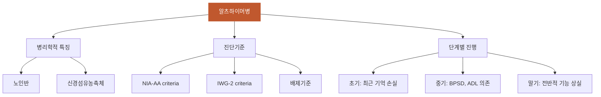

# 알츠하이머병

## 핵심 내용

# 알츠하이머병 (Alzheimer's Disease)

## 핵심 개념

## 1. 알츠하이머병 (Alzheimer's Disease, AD)

### 1-1. 개요

치매 원인 질환의 60~70%를 차지하는 가장 대표적인 퇴행성 뇌질환이다. 65세 이상에서 5세가 경과할 때마다 유병률이 약 2배씩 증가한다. 병리학적으로는 노인반(amyloid plaque)과 신경섬유농축체(neurofibrillary tangle, NFT)가 특징적이며, 10~15년에 걸쳐 서서히 진행된다.

### 1-2. 진단기준

#### NIA-AA criteria (McKhann et al., 2011)
- A. 점진적 발병, 6개월 이상 진행성 인지 저하

## 1. 알츠하이머병 (Alzheimer's Disease, AD)

### 1-1. 개요

치매 원인 질환의 60~70%를 차지하는 가장 대표적인 퇴행성 뇌질환이다. 65세 이상에서 5세가 경과할 때마다 유병률이 약 2배씩 증가한다. 병리학적으로는 노인반(amyloid plaque)과 신경섬유농축체(neurofibrillary tangle, NFT)가 특징적이며, 10~15년에 걸쳐 서서히 진행된다.

### 1-2. 진단기준

#### NIA-AA criteria (McKhann et al., 2011)
- A. 점진적 발병, 6개월 이상 진행성 인지 저하
- B. 해마형 기억장애(amnestic syndrome of hippocampal type)가 전형적
- 비기억형: 언어형, 시공간형, 실행기능형도 존재
- 지지적 소견: 내측 측두엽 위축(MRI), 측두-두정엽 저대사(PET), CSF 바이오마커

#### IWG-2 criteria (Dubois et al., 2014)
- A. 임상 표현형(해마형 기억장애 또는 비전형 표현형)
- B. 생체 내 알츠하이머 병리 증거: CSF Aβ1-42 감소 + T-tau/P-tau 증가, 아밀로이드 PET 양성, 또는 AD 상염색체 우성 돌연변이(PSEN1, PSEN2, APP)

#### 배제 기준
- 갑작스러운 발병, 초기 보행장애/경련/행동변화
- 국소 신경학적 소견, 추체외로 징후, 초기 환각
- 인지 변동(cognitive fluctuations), 주요 우울증

### 1-3. 단계별 증상 진행

| 단계 | 시기 | 주요 증상 |
|-----|------|---------|
| 초기 | ~3년 | 최근 기억 손실, 단어 찾기 어려움, 약속 잊음, 기억력 저하 자각 |
| 중기 | 2~10년 | 배회, BPSD 출현, 실어증/실행증/실인증, ADL 의존 증가 |
| 말기 | 8년+ | 전반적 기능 상실, 삼킴장애, 보행불능, 감염 취약, 사망 |

### 1-4. 인지 장애와 ADL의 불일치

일부 환자는 심각한 인지 장애에도 불구하고 활동적 생활 습관으로 인해 ADL이 상대적으로 유지되는 경우가 있다. 반대로 MMSE에 비해 ADL 저하가 큰 경우에는 신체적 쇠약이나 우울증 동반을 의심해야 한다.

-----

## 핵심 키워드

알츠하이머병, 알츠하이머병, Alzheimer's Disease


# 알츠하이머병 통합 학습

## 체크리스트

□ C1: 알츠하이머병의 정의와 특징
□ C2: 진단기준과 배제진단
□ C3: 다른 치매와의 감별점
□ C4: 단계별 진행 양상
□ C5: 임상 적용 — "이 환자에게 위 개념을 적용하여 판단/설명"

체크 규칙:
- 학습자가 해당 개념을 "자기 말로" 표현하면 체크
- 교재 문장을 그대로 반복하는 것은 체크 안 함
- 한 턴에 여러 항목이 동시에 체크될 수 있음

## 교수 전략

### PS-I 첫 사례

> 박영희(72세) 할머니가 딸과 함께 외래에 내원했다. 딸은 "6개월 전부터 어머니가 같은 질문을 계속 반복하고, 어제 먹은 음식을 기억하지 못해요. 처음엔 나이 들어서 그런가 했는데 점점 심해지고 있어요"라고 호소했다. 환자는 "내 기억력이 예전 같지 않다"며 본인도 변화를 인식하고 있었다.

이 사례를 제시하고 학습자에게 물어보세요:
- "이 환자에게 나타나는 증상의 특징은 무엇이며, 어떤 질환을 의심해볼 수 있을까요?"

### 체크리스트별 교수 힌트

**C1 유도:**
- "알츠하이머병이 무엇인지, 어떤 특징을 가진 질병인지 설명해보세요"
- "치매와 알츠하이머병의 관계는 어떻게 되나요?"

**C2 유도:**
- "알츠하이머병을 진단하기 위해서는 어떤 기준들이 필요할까요?"
- "반대로 알츠하이머병이 아닌 다른 질환들을 배제하려면 어떤 증상들을 확인해야 할까요?"

**C3 유도:**
- "갑자기 발병하면서 보행장애가 동반된 치매와 알츠하이머병은 어떻게 구별할 수 있을까요?"
- "환각이나 인지 기능의 변동이 심한 치매와는 어떤 차이가 있나요?"

**C4 유도:**
- "알츠하이머병은 어떻게 진행되나요? 시기별로 어떤 증상들이 나타나는지 설명해보세요"
- "초기, 중기, 말기 각 단계의 특징적인 증상들은 무엇인가요?"

**C5 (임상 적용):**
- C1~C4를 배운 후: "박영희 할머니 사례로 돌아가서, 지금까지 배운 내용을 종합하여 이 환자의 상태를 평가하고 간호계획을 세워보세요"

## 자료



```tip
• 알츠하이머병은 치매의 60-70%를 차지하는 대표적인 퇴행성 뇌질환이다
• 점진적 발병과 해마형 기억장애가 특징적이며, 갑작스러운 발병이나 초기 보행장애는 배제 소견이다
• 10-15년에 걸쳐 초기(기억력 저하) → 중기(BPSD, ADL 의존) → 말기(전반적 기능 상실) 순으로 진행한다
```
