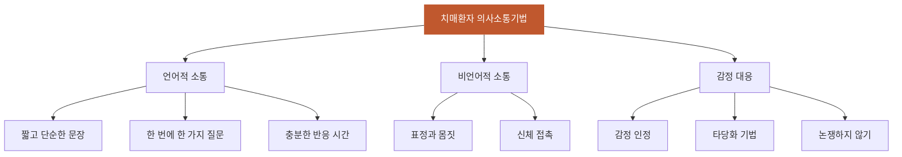

# 의사소통기법

## 핵심 내용

# 의사소통 기법 (Communication Techniques)

## 핵심 개념

### 3-1. 의사소통 기법

치매 환자와의 효과적 의사소통 원칙:
- 짧고 단순한 문장을 사용한다
- 한 번에 한 가지 질문만 한다
- 환자의 감정을 인정하고 타당화(validation)한다
- 비언어적 소통(표정, 몸짓, 접촉)을 적극 활용한다
- 환자가 반응할 시간을 충분히 기다린다
- 논쟁하거나 교정하려 하지 않는다

## 핵심 키워드

의사소통기법, 의사소통 기법, Communication Techniques


# 의사소통기법 (Communication Techniques) - 통합 학습 파일

## 체크리스트

□ C1: 치매환자 의사소통 시 기본 원칙 설명하기
□ C2: 효과적인 언어적 소통 기법 구분하기  
□ C3: 비언어적 소통과 언어적 소통의 차이점
□ C4: 타당화(validation) 기법의 목적과 방법
□ C5: 임상 적용 — "이 환자에게 위 개념을 적용하여 판단/설명"

체크 규칙:
- 학습자가 해당 개념을 "자기 말로" 표현하면 체크
- 교재 문장을 그대로 반복하는 것은 체크 안 함
- 한 턴에 여러 항목이 동시에 체크될 수 있음

## 교수 전략

### PS-I 첫 사례

> 김○○ 할머니(78세)는 중등도 치매로 요양원에 입원 중이다. 간병인이 "할머니, 저녁 드시고 약도 드시고 양치도 하셔야 해요"라고 말하자 할머니는 화를 내며 "나는 밥도 안 먹었는데 왜 자꾸 시켜!"라고 소리쳤다. 가족은 "할머니가 왜 이렇게 예민해졌는지 모르겠다"고 호소했다.

이 사례를 제시하고 학습자에게 물어보세요:
- "간병인의 의사소통 방식에서 어떤 문제점을 찾을 수 있을까요?"

### 체크리스트별 교수 힌트

**C1 유도:**
- "치매 환자와 대화할 때 가장 중요하게 고려해야 할 점들은 무엇일까요?"

**C2 유도:**
- "김 할머니에게 어떤 방식으로 말을 걸었다면 더 좋았을까요? 구체적인 문장으로 표현해보세요."

**C3 유도:**
- "말로 하는 것 외에 치매 환자와 소통할 수 있는 다른 방법들은 어떤 것들이 있을까요?"

**C4 유도:**
- "할머니가 '밥도 안 먹었다'고 화낼 때, 간호사는 어떻게 반응하는 것이 좋을까요?"

**C5 (임상 적용):**
- C1~C4를 배운 후: "김 할머니 상황에서 배운 의사소통 기법들을 모두 활용하여 어떻게 접근할지 단계별로 설명해보세요."

## 자료



```tip
치매환자 의사소통의 핵심은 '단순-명확-공감'입니다. 복잡한 지시보다는 한 번에 하나씩, 환자의 감정을 인정하며, 말보다는 따뜻한 표정과 접촉으로 마음을 전달하세요.
```
