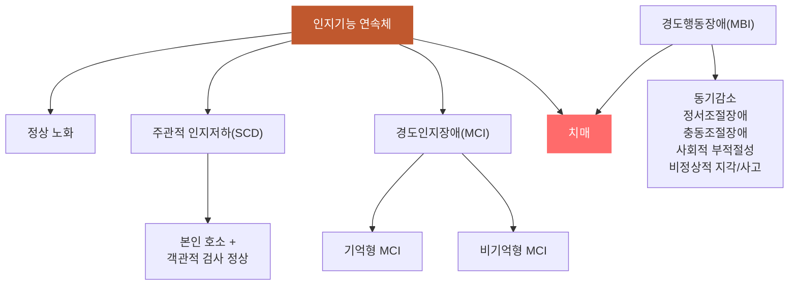

# 인지기능_연속체

## 핵심 내용

# 인지기능의 연속체 (Cognitive Continuum)

## 핵심 개념

## 2. 인지기능의 연속체

### 2-1. 정상에서 치매까지의 스펙트럼

인지기능은 정상 노화부터 치매까지 연속적인 스펙트럼으로 존재한다. 이 연속체를 이해하는 것은 조기 발견과 예방적 개입의 핵심이다.

| 단계 | 주관적 인지저하 | 객관적 인지장애 | 일상기능 상실 |
|-----|:---:|:---:|:---:|
| 정상 노화 | - | - | - |
| 주관적 인지저하(SCD) | + | - | - |

## 2. 인지기능의 연속체

### 2-1. 정상에서 치매까지의 스펙트럼

인지기능은 정상 노화부터 치매까지 연속적인 스펙트럼으로 존재한다. 이 연속체를 이해하는 것은 조기 발견과 예방적 개입의 핵심이다.

| 단계 | 주관적 인지저하 | 객관적 인지장애 | 일상기능 상실 |
|-----|:---:|:---:|:---:|
| 정상 노화 | - | - | - |
| 주관적 인지저하(SCD) | + | - | - |
| 경도인지장애(MCI) | + | + | - |
| 치매 | + | + | + |

### 2-2. 주관적 인지저하 (Subjective Cognitive Decline, SCD)

본인은 기억력 저하를 호소하지만 객관적 검사에서는 정상 범위인 상태이다. SCD는 치매의 가장 초기 단계로 주목받고 있다.

SCD에서 주의할 점은 다음과 같다:
- APOE ε4 보유자는 경도인지장애로 전환될 위험이 약 2배 높다
- 흡연자, 호르몬 치료를 받지 않은 여성에서 치매 진행이 빠른 경향이 있다
- 전임상 단계(pre-clinical stage)에서는 뇌 병리 변화가 이미 시작되었으나 증상은 없으며, 이 시기는 증상 발현 15~20년 전부터 시작된다

### 2-3. 경도인지장애 (Mild Cognitive Impairment, MCI)

인지기능 검사에서 객관적 저하가 확인되지만 일상생활 기능은 유지되는 상태이다. MCI는 치매의 전단계로, 연간 약 10~15%가 치매로 전환된다.

MCI의 아형은 다음과 같다:
- 기억형 MCI(amnestic MCI): 기억력 장애가 주된 증상 → 알츠하이머병으로 전환 가능성 높음
- 비기억형 MCI(non-amnestic MCI): 실행기능, 언어, 시공간능력 장애 → 다른 유형의 치매로 전환 가능성

### 2-4. 경도행동장애 (Mild Behavioral Impairment, MBI)

인지기능이 아니라 행동/심리증상이 먼저 두드러지는 치매 전 단계도 존재한다. MBI는 50세 이상에서 6개월 이상 지속되는 행동/성격 변화로 정의된다.

인지기능의 연속체에서 MBI의 위치는 다음과 같다:
- 인지 축: 정상 → SCD → MCI → 치매
- 행동 축: 정상 → MBI → 치매

MBI의 5가지 도메인은 동기감소, 정서조절장애, 충동조절장애, 사회적 부적절성, 비정상적 지각/사고로 구성된다.

-----

## 3. 치매의 역학

## 핵심 키워드

인지기능, 연속체, 인지기능의 연속체, Cognitive Continuum


# 인지기능 연속체 — 간호 교육 통합 학습 파일

## 체크리스트

□ C1: 인지기능 연속체의 4단계와 특징
□ C2: SCD와 MCI의 임상적 의미
□ C3: MCI와 정상노화, 치매의 감별점
□ C4: MBI의 개념과 5가지 도메인
□ C5: 임상 적용 — "이 환자에게 위 개념을 적용하여 판단/설명"

체크 규칙:
- 학습자가 해당 개념을 "자기 말로" 표현하면 체크
- 교재 문장을 그대로 반복하는 것은 체크 안 함
- 한 턴에 여러 항목이 동시에 체크될 수 있음

## 교수 전략

### PS-I 첫 사례

> 72세 김○○님이 딸과 함께 외래를 방문했습니다. "요즘 아버지가 자꾸 깜빡한다고 하시는데 제가 봐서는 예전과 똑같아요. 그런데 아버지가 너무 걱정하세요."라고 딸이 말합니다. 환자분은 "집 열쇠를 어디 뒀는지 모르겠고, 약속 시간도 가끔 헷갈려요"라고 호소합니다. 인지기능 검사 결과는 정상 범위였습니다.

이 사례를 제시하고 학습자에게 물어보세요:
- "이 환자의 상태를 어떻게 판단하시겠습니까?"

### 체크리스트별 교수 힌트

**C1 유도:**
- "인지기능이 정상에서 치매로 가는 과정을 단계별로 설명해보세요"
- "각 단계에서 주관적 증상, 객관적 검사, 일상기능은 어떻게 다른가요?"

**C2 유도:**
- "본인은 문제를 호소하지만 검사는 정상인 상태를 뭐라고 하나요?"
- "MCI에서 치매로 진행하는 비율은 어느 정도인가요?"

**C3 유도:**
- "MCI와 정상 노화를 어떻게 구분할 수 있나요?"
- "MCI와 치매의 결정적 차이점은 무엇인가요?"

**C4 유도:**
- "인지기능보다 행동 변화가 먼저 나타나는 경우도 있나요?"
- "MBI의 5가지 영역을 설명해보세요"

**C5 (임상 적용):**
- C1~C4를 배운 후: "김○○님을 인지기능 연속체 어느 단계로 판단하고, 어떤 간호 중재가 필요할까요?"

## 자료



```tip
- 인지기능은 정상→SCD→MCI→치매로 연속적 변화
- MCI는 연간 10-15%가 치매로 진행하는 고위험 상태  
- 행동 변화(MBI)도 치매 전 단계의 중요한 신호
```
