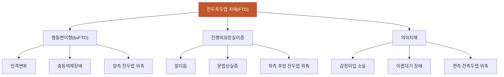

# 전두측두엽_치매

## 핵심 내용

# 전두측두엽 치매 (Frontotemporal Dementia)

## 핵심 개념

## 4. 전두측두엽 치매 (Frontotemporal Dementia, FTD)

### 4-1. 개요

초기기치매(presenile dementia)의 가장 흔한 원인 중 하나로, 50~60대 초반에 발병하는 경우가 흔하다. 전체의 약 10%에서 상염색체 우성 유전이 확인되며, 가족력이 있는 비율은 30~40%에 이른다.

### 4-2. 3가지 아형

| 아형 | 초기 증상 | 인지 특징 | 뇌영상 |
|-----|---------|---------|------|

## 4. 전두측두엽 치매 (Frontotemporal Dementia, FTD)

### 4-1. 개요

초기기치매(presenile dementia)의 가장 흔한 원인 중 하나로, 50~60대 초반에 발병하는 경우가 흔하다. 전체의 약 10%에서 상염색체 우성 유전이 확인되며, 가족력이 있는 비율은 30~40%에 이른다.

### 4-2. 3가지 아형

| 아형 | 초기 증상 | 인지 특징 | 뇌영상 |
|-----|---------|---------|------|
| 행동변이형 (bvFTD) | 인격변화, 무감동, 충동억제장애, 부적절한 언행, 식욕변화 | 실행기능/판단력 저하, 기억·시공간 상대적 보존 | 양측 전두엽·전측두엽 위축 |
| 진행비유창실어증 | 말더듬, 유창성 저하 | 문법상실증, 복잡 문장 이해 저하 | 좌측 후방 전두엽·뇌섬엽 위축 |
| 의미치매 | 감정이입 소실, 융통성 없음, 강박 | 이름대기 장애, 단어 개념 소실 | 편측(주로 좌측) 전측두엽 위축 |

### 4-3. bvFTD와 알츠하이머병의 감별

bvFTD는 초기부터 인격 변화와 행동 장애가 두드러지는 반면, 기억력은 비교적 유지된다. 반면 알츠하이머병은 초기에 기억장애가 가장 두드러진다. 이 차이가 감별의 핵심이다.

bvFTD 환자에서 탈억제 행동(사회적/성적으로 부적절한 행동), 반복행동(유병률 60~87%), 무감동이 특징적으로 나타난다.

-----

## 핵심 키워드

전두측두엽, 치매, 전두측두엽 치매, Frontotemporal Dementia


# 전두측두엽 치매 통합 학습 파일

## 체크리스트

□ C1: 전두측두엽 치매의 주요 특징과 발병 연령대
□ C2: 3가지 아형의 증상 및 뇌 손상 부위 특성
□ C3: bvFTD와 알츠하이머병의 감별점
□ C4: 유전적 요인과 가족력의 역할
□ C5: 임상 적용 — "이 환자에게 위 개념을 적용하여 판단/설명"

체크 규칙:
- 학습자가 해당 개념을 "자기 말로" 표현하면 체크
- 교재 문장을 그대로 반복하는 것은 체크 안 함
- 한 턴에 여러 항목이 동시에 체크될 수 있음

## 교수 전략

### PS-I 첫 사례

> 김철수(58세) 환자가 가족과 함께 신경과 외래에 내원했습니다. 아내는 "2년 전부터 성격이 완전히 달라졌어요. 예전에는 예의바르던 사람이 상점에서 물건을 허락 없이 만지고, 낯선 사람에게 지나치게 친근하게 대해요. 그런데 기억력은 괜찮은 것 같아요"라고 호소했습니다. 환자는 면담 중 충동적인 행동을 보이며 같은 질문을 반복했습니다.

이 사례를 제시하고 학습자에게 물어보세요:
- "이 환자의 증상 패턴에서 어떤 유형의 치매를 의심할 수 있을까요?"

### 체크리스트별 교수 힌트

**C1 유도:**
- "전두측두엽 치매는 주로 어느 연령대에서 발생하며, 다른 치매와 비교해 어떤 특징이 있나요?"

**C2 유도:**
- "전두측두엽 치매의 세 가지 아형은 각각 어떤 증상으로 시작되고, 뇌의 어느 부위가 손상되나요?"

**C3 유도:**
- "행동변이형 전두측두엽 치매와 알츠하이머병을 구별하는 가장 중요한 차이점은 무엇인가요?"

**C4 유도:**
- "전두측두엽 치매에서 유전적 요인은 얼마나 중요한 역할을 하나요?"

**C5 (임상 적용):**
- C1~C4를 배운 후: "위 사례의 김철수 환자에게 나타난 증상들을 전두측두엽 치매의 개념으로 설명하고, 추가로 확인해야 할 사항들을 제시해보세요."

## 자료



```tip
전두측두엽 치매는 50-60대 초반 발병하는 초기치매의 주요 원인으로, 초기부터 인격변화와 행동장애가 두드러지지만 기억력은 상대적으로 보존됩니다.
3가지 아형(행동변이형, 진행비유창실어증, 의미치매)은 각각 다른 뇌 부위 손상과 고유한 증상을 보입니다.
가족력이 30-40%에서 나타나며, 알츠하이머병과 달리 초기 기억력이 보존되는 것이 감별의 핵심입니다.
```
