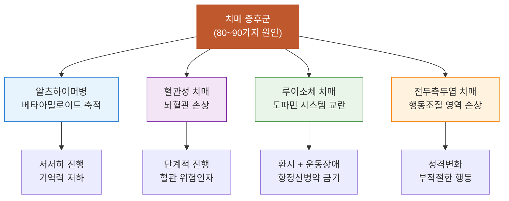

# 치매_개요

## 핵심 내용

# 1단원. 치매는 질병이 아니라 증후군이다

---

## 1. 엑스레이에 찍히지 않는 병

뼈가 부러지면 엑스레이에 하얀 금이 선명하게 나타나고, 의사는 그걸 가리키며 "여기 부러졌네요, 깁스합시다"라고 말한다. 명확하고 깔끔하다. 원인과 결과가 딱 떨어지니 환자도, 보호자도 안도감을 느낀다.

그런데 뇌질환의 세계로 발을 들이밀는 순간, 그 엑스레이 기계는 마치 고장이 난 것처럼 쓸모없어진다. 같은 부위가 손상되어도 환자마다 완전히 다른 증상이 튀어나오고, 겉보기에는 치매처럼 보이지만 사실은 감쪽같은 가짜 치매인 경우도 있다. 그 진흙탕 같은 진단의 세계에서 명확한 기준을 찾아내는 것이 이 단원의 미션이다.


## 2. 치매는 병 이름이 아니다

보통 우리는 치매를 감기나 암처럼 하나의 질병이라고 생각한다. 병원에 가서 "치매약 주세요"라고 말하는 것도 그 오해에서 비롯된다.

그런데 의학적으로 치매는 **질병(Disease)이 아니라 증후군(Syndrome)**이다.

이 차이는 결정적이다. 증후군이란 다양한 원인 질환들이 만들어내는 **공통된 결과적 상태, 즉 증상들의 묶음**을 가리키는 말이기 때문이다.

발열에 비유하면 이해가 쉽다. "열이 난다"는 현상은 동일하지만 그 원인은 가벼운 감기일 수도 있고, 요로감염일 수도 있고, 최악의 경우 패혈증일 수도 있다. 열이 난다고 해서 원인도 모른 채 해열제부터 들이킨다면 어떻게 되겠는가? 패혈증 환자에게 타이레놀을 먹인 셈이 된다.

치매도 정확히 같다. "인지 기능이 무너진다"는 겉보기 증상 이면에는 무려 **80가지에서 90가지에 달하는 서로 다른 원인 질환**이 숨어 있다. 이 수많은 원인 질환들이 뇌를 각기 다른 방식으로 망가뜨려서 만들어내는 공통된 결과, 그 상태들의 묶음을 의학에서는 '치매 증후군'이라고 부르는 것이다.

따라서 "당장 치매약 좀 주세요"라는 요구는, 두통의 원인이 수면 부족인지 뇌종양인지도 파악하지 않은 채 "두통약 내놓으라"고 하는 것과 본질적으로 같다.


## 3. 원인에 따라 뇌가 파괴되는 방식이 완전히 다르다

그렇다면 90여 가지의 원인 질환들은 뇌를 대체 어떻게 다르게 망가뜨리는 걸까?

**알츠하이머병**은 뇌에 베타아밀로이드라는 비정상적인 단백질 쓰레기가 수십 년에 걸쳐 서서히 쌓이면서 뇌세포를 질식시키는 방식이다. 집 안에 쓰레기가 20년간 조금씩 쌓이다가 어느 순간 생활 자체가 불가능해지는 것에 비유할 수 있다.

**혈관성 치매**는 메커니즘이 완전히 다르다. 뇌로 가는 미세혈관들이 막히거나 팍 터져서 특정 뇌 부위가 산소를 공급받지 못해 괴사하는 물리적 손상이다. 쓰레기가 쌓이는 것이 아니라 수도관이 터지는 것이다. 따라서 치료 전략도 완전히 다르다. 알츠하이머 약을 먹일 게 아니라 혈관 위험 인자(혈압, 혈당, 고지혈증)를 관리해야 한다.

**루이소체 치매**는 뇌세포 안에 루이소체라는 단백질 덩어리가 침착되면서 도파민 전달 체계를 심각하게 교란시킨다. 이 때문에 환자는 없는 사람이 눈앞에 뚜렷하게 서 있는 것 같은 **생생한 환시(幻視)**를 경험하고, 파킨슨병과 비슷한 운동 장애도 겪는다.

여기서 절대로 넘어서는 안 될 치명적인 함정이 하나 있다. 만약 의사가 원인을 정확히 감별하지 않은 채, 환각 증상만 보고 조현병에 쓰는 일반적인 항정신병 약물을 이 환자에게 투여하면 어떻게 되겠는가? 루이소체 치매 환자의 뇌는 이미 도파민이 극도로 고갈된 상태인데, 거기에 도파민 수용체를 완전히 차단해버리는 약을 부어넣는 셈이 된다. 결과는 전신 근육이 돌처럼 굳어버리거나, 의식이 떨어지거나, 최악의 경우 생명을 잃는 것이다. **불을 끄겠다고 기름을 들이붓는 격이다.**

**전두측두엽 치매**는 더 기이하다. 기억을 관장하는 영역이 아니라, 사회적 행동을 조절하는 전두엽의 브레이크가 먼저 망가진다. 그래서 가족의 얼굴은 잘 기억하면서도 갑자기 성격이 완전히 바뀌고, 공공장소에서 부적절한 행동을 하고, 충동을 전혀 통제하지 못하는 모습을 보인다.

이 네 가지만 봐도, 겉으로는 모두 "치매"로 보이지만 뇌를 파괴하는 메커니즘 자체가 완전히 다르다는 것을 알 수 있다. 원인을 모른 채 약을 쓰는 것이 단순히 '효과가 없는' 수준이 아니라, 환자의 목숨을 직접 위협할 수 있는 이유가 여기에 있다.

<!-- ===== [이미지 A] 원인별 파괴 메커니즘 비유 삽화 위치 ===== -->

<div align="center">
<svg width="720" viewBox="0 0 720 340" xmlns="http://www.w3.org/2000/svg" style="font-family:'Pretendard Variable',-apple-system,'Malgun Gothic',sans-serif;max-width:100%;">
<rect width="720" height="340" fill="#ffffff" rx="12"/>
<!-- Central node -->
<rect x="245" y="24" width="230" height="64" rx="12" fill="#fff4ef" stroke="#d85a30" stroke-width="2"/>
<text x="360" y="50" text-anchor="middle" font-size="17" font-weight="700" fill="#993c1d">치매 (Dementia)</text>
<text x="360" y="72" text-anchor="middle" font-size="12" fill="#d85a30">질병이 아닌 증후군</text>
<!-- Connector lines -->
<line x1="290" y1="88" x2="115" y2="140" stroke="#c4c3be" stroke-width="1.2"/>
<line x1="330" y1="88" x2="275" y2="140" stroke="#c4c3be" stroke-width="1.2"/>
<line x1="390" y1="88" x2="435" y2="140" stroke="#c4c3be" stroke-width="1.2"/>
<line x1="430" y1="88" x2="595" y2="140" stroke="#c4c3be" stroke-width="1.2"/>
<!-- Branch 1: Alzheimer -->
<rect x="30" y="140" width="170" height="56" rx="10" fill="#f0effc" stroke="#6b62c2" stroke-width="1.2"/>
<text x="115" y="164" text-anchor="middle" font-size="14" font-weight="700" fill="#3c3489">알츠하이머병</text>
<text x="115" y="182" text-anchor="middle" font-size="12" fill="#6b62c2">60~75%</text>
<!-- Branch 2: Vascular -->
<rect x="210" y="140" width="130" height="56" rx="10" fill="#edf5fb" stroke="#3a7cb8" stroke-width="1.2"/>
<text x="275" y="164" text-anchor="middle" font-size="14" font-weight="700" fill="#0c447c">혈관성 치매</text>
<text x="275" y="182" text-anchor="middle" font-size="12" fill="#3a7cb8">15~20%</text>
<!-- Branch 3: Lewy Body -->
<rect x="370" y="140" width="130" height="56" rx="10" fill="#e8f5f1" stroke="#1a8e6e" stroke-width="1.2"/>
<text x="435" y="164" text-anchor="middle" font-size="14" font-weight="700" fill="#085041">루이소체 치매</text>
<text x="435" y="182" text-anchor="middle" font-size="12" fill="#1a8e6e">~5%</text>
<!-- Branch 4: Frontotemporal -->
<rect x="520" y="140" width="150" height="56" rx="10" fill="#f9edf2" stroke="#b84878" stroke-width="1.2"/>
<text x="595" y="164" text-anchor="middle" font-size="14" font-weight="700" fill="#72243e">전두측두엽 치매</text>
<text x="595" y="182" text-anchor="middle" font-size="12" fill="#b84878">~5%</text>
<!-- Other causes note -->
<rect x="460" y="212" width="170" height="32" rx="8" fill="#f4f3ee" stroke="#b4b2a9" stroke-width="0.8"/>
<text x="545" y="233" text-anchor="middle" font-size="11" fill="#73726c">+ 80~90가지 기타 원인</text>
<!-- Bottom comparison: Fever analogy -->
<rect x="40" y="264" width="300" height="56" rx="10" fill="#fdf8f0" stroke="#d4a84a" stroke-width="1"/>
<text x="190" y="286" text-anchor="middle" font-size="13" font-weight="600" fill="#7a5c12">비유: "열이 난다" = 증상</text>
<text x="190" y="304" text-anchor="middle" font-size="11" fill="#9e7a2a">감기? 요로감염? 패혈증? → 원인이 다르다</text>
<text x="370" y="292" text-anchor="middle" font-size="16" fill="#c4c3be">≈</text>
<rect x="400" y="264" width="280" height="56" rx="10" fill="#fff4ef" stroke="#d85a30" stroke-width="1"/>
<text x="540" y="286" text-anchor="middle" font-size="13" font-weight="600" fill="#993c1d">"인지기능이 무너진다" = 증상</text>
<text x="540" y="304" text-anchor="middle" font-size="11" fill="#d85a30">알츠하이머? 혈관? 루이소체? → 원인이 다르다</text>
</svg>
</div>


<!-- 알츠하이머(쓰레기 쌓인 집) / 혈관성(터진 수도관) / 루이소체(오염된 화학 시스템) 3분할 비유 일러스트 -->


## 4. 그렇다면 대체 무엇을 보고 치매라고 부르는가: 진단의 3대 요건

90여 가지의 각기 다른 폭탄들이 터지고 있는 와중에, 의사들은 환자의 어떤 상태를 보고 "당신은 지금 치매 증후군에 진입했습니다"라고 선언하는 걸까? 그 수많은 원인들을 아우르는 절대적인 공통 분모, 반드시 충족해야 하는 세 가지 요건이 있다.

<!-- ===== [도표 2] 진단 3대 요건 ===== -->
<div align="center">

<svg width="720" viewBox="0 0 720 120" xmlns="http://www.w3.org/2000/svg" style="font-family:'Pretendard Variable',-apple-system,'Malgun Gothic',sans-serif;max-width:100%;">
<rect width="720" height="120" fill="#ffffff" rx="12"/>
<rect x="20" y="16" width="216" height="88" rx="12" fill="#fff4ef" stroke="#d85a30" stroke-width="1.2"/>
<text x="128" y="44" text-anchor="middle" font-size="26" font-weight="800" fill="#d85a30">①</text>
<text x="128" y="68" text-anchor="middle" font-size="14" font-weight="700" fill="#993c1d">후천적 변화</text>
<text x="128" y="88" text-anchor="middle" font-size="11" fill="#d85a30">이전에는 정상 → 현재 저하</text>
<rect x="252" y="16" width="216" height="88" rx="12" fill="#fff4ef" stroke="#d85a30" stroke-width="1.2"/>
<text x="360" y="44" text-anchor="middle" font-size="26" font-weight="800" fill="#d85a30">②</text>
<text x="360" y="68" text-anchor="middle" font-size="14" font-weight="700" fill="#993c1d">다영역 손상</text>
<text x="360" y="88" text-anchor="middle" font-size="11" fill="#d85a30">6대 인지 영역 중 2개↑ 동시 저하</text>
<rect x="484" y="16" width="216" height="88" rx="12" fill="#fff4ef" stroke="#d85a30" stroke-width="1.2"/>
<text x="592" y="44" text-anchor="middle" font-size="26" font-weight="800" fill="#d85a30">③</text>
<text x="592" y="68" text-anchor="middle" font-size="14" font-weight="700" fill="#993c1d">ADL 상실</text>
<text x="592" y="88" text-anchor="middle" font-size="11" fill="#d85a30">독립적 일상생활 수행 불가</text>
</svg>

</div>

### 4.1 첫 번째 요건: 후천적 변화(Acquired)

태어날 때는 정상이었다. 뇌의 신경망이 한 번은 완벽하게 완성되어 정상적으로 기능하다가, 어떤 원인에 의해 그 물리적 구조가 허물어지기 시작한 것이어야 한다. 원래 멀쩡하게 잘 돌아가던 건물이 서서히 무너지는 과정이지, 애초에 설계가 잘못되어 불량으로 지어진 건물이 아니라는 뜻이다. 이것으로 선천적 지적 장애와 구별한다.

### 4.2 두 번째 요건: 다영역 손상(Multi-domain Impairment)

미국정신의학회 DSM-5는 인간의 인지 기능을 여섯 가지 핵심 영역으로 분류한다: 학습과 기억, 언어, 실행 기능, 복합 주의력, 지각-운동(시공간), 사회인지. 치매에서는 이 중 **둘 이상이 동시에** 무너져야 한다.

거대한 교향악단을 떠올려보면 된다. 바이올린(기억) 파트 하나만 음을 놓치는 게 아니라, 관악기(언어)도 삐끗하고, 타악기(실행 기능)도 엇박이 나고, 지휘자(사회인지)마저 지휘봉을 놓아버리면서 음악 자체가 붕괴하는 것이다.

그중에서도 사회인지 영역의 손상은 보호자를 가장 혼란스럽게 만든다. 전두엽은 "지금 식당이니까 남의 반찬을 집어 먹으면 안 돼"라고 충동을 억제하는 브레이크 역할을 한다. 이 브레이크의 물리적 회로 자체가 끊어져 버리면 환자는 공공장소에서 갑자기 부적절한 행동을 하게 된다. 이것은 환자의 도덕성이 타락한 것이 아니라, **뇌의 브레이크 패드가 닳아없어진 완전한 물리적 고장**이다.

<!-- ===== [이미지 B] 6대 인지 영역 교향악단 비유 일러스트 위치 ===== -->

### 4.3 세 번째 요건: 일상생활 기능 상실(ADL Loss)

이것이 치매 진단의 가장 결정적인 임상적 분수령이다. 인지 기능이 여러 군데 떨어졌어도, 환자 스스로 식사를 챙기고 제때 약을 먹고 은행에 가서 공과금을 낼 수 있다면 치매 증후군으로 진단하지 않는다.

**타인의 물리적·인지적 개입 없이는 독립적인 생존 자체가 불가능해지는 지점**, 거기가 바로 치매의 시작선이다.


## 5. 당신의 깜빡거림은 치매인가: 건망증과의 감별

여기까지 읽은 당신은 아마 덜컥 겁이 났을 것이다. "나도 요새 스마트폰 어디 뒀는지 맨날 깜빡하는데, 혹시 내 뇌의 교향악단도 무너지고 있는 건가?"

결론부터 말하면, 자연스러운 노화에 의한 건망증과 치매는 메커니즘 자체가 완전히 다르다.

**첫 번째 감별점: 힌트 반응**

건망증은 정보가 뇌라는 하드디스크에 저장은 되어 있으나, 그 파일을 찾는 검색 엔진이 느려진 상태이다. 누군가 "아까 식탁에 열쇠 두시던데요"라고 힌트라는 검색어를 던져주면, 뇌가 경로를 찾아내서 "아, 맞다!" 하고 바로 데이터를 로딩해낸다.

그러나 치매의 메커니즘은 전혀 다르다. 알츠하이머병의 단백질 찌꺼기가 가장 먼저 파괴하는 곳이 바로 새로운 기억을 입력하는 해마이다. **저장 자체가 되지 않았으므로**, 아무리 검색어를 넣어도 원본 파일 자체가 존재하지 않는다. 인출 실패가 아니라 저장 실패다.

**두 번째 감별점: 병식(Illness Awareness)**

지금 이 글을 읽으며 "나 요새 왜 자꾸 깜빡하지?" 하고 걱정하는 당신. 그 걱정 자체가 뇌의 상위 인지 기능, 즉 **메타인지(자아 모니터링 시스템)**가 건강하게 작동하고 있다는 강력한 증거이다. 뇌가 "뭔가를 잊어버렸다"는 사실을 알고 있는 상태인 것이다.

그러나 치매가 진행되면 전두엽의 모니터링 시스템마저 파괴되면서, 자신이 기억을 잃었다는 사실 자체를 인지하지 못하게 된다. 메모를 할 필요성조차 느끼지 못한다.

그러니까 당신의 부모님이 수첩을 사서 "아차, 아침 약 안 먹었네" 하고 스스로 찾아 먹으신다면 뇌가 아주 건강하게 작동 중인 것이다.

**세 번째 감별점: 일상생활의 독립성**

"아, 오늘 아침 약을 깜빡했네" 하고 스스로 깨달아 다시 물을 떠와서 약을 먹는 것은 정상 노화의 범위이다. 그러나 눈앞에 약 봉지가 수북하게 쌓여 있는데도 "이게 무슨 약인지, 어떻게 입에 넣는 건지" 판단이 서지 않아서 타인이 직접 입에 넣어줘야 하는 상태가 되면, 그때 치매의 영역으로 넘어간 것이다.

<!-- ===== [도표 3] 건망증 vs 치매 감별표 ===== -->
<div align="center">

<svg width="720" viewBox="0 0 720 230" xmlns="http://www.w3.org/2000/svg" style="font-family:'Pretendard Variable',-apple-system,'Malgun Gothic',sans-serif;max-width:100%;">
<rect width="720" height="230" fill="#ffffff" rx="12"/>
<!-- Header -->
<rect x="20" y="12" width="160" height="34" rx="6" fill="#f4f3ee"/>
<text x="100" y="34" text-anchor="middle" font-size="12" font-weight="700" fill="#5f5e5a">구분</text>
<rect x="190" y="12" width="250" height="34" rx="6" fill="#e8f5f1"/>
<text x="315" y="34" text-anchor="middle" font-size="12" font-weight="700" fill="#085041">건망증 (정상 노화)</text>
<rect x="450" y="12" width="250" height="34" rx="6" fill="#fff4ef"/>
<text x="575" y="34" text-anchor="middle" font-size="12" font-weight="700" fill="#993c1d">치매</text>
<!-- Row 1 -->
<text x="100" y="72" text-anchor="middle" font-size="12" font-weight="600" fill="#2c2c2a">힌트 반응</text>
<text x="315" y="72" text-anchor="middle" font-size="12" fill="#0f6e56">"아, 맞다!" — 기억 복구됨</text>
<text x="575" y="72" text-anchor="middle" font-size="12" fill="#993c1d">힌트 줘도 전혀 기억 못함</text>
<line x1="20" y1="86" x2="700" y2="86" stroke="#e8e6e0" stroke-width="0.5"/>
<!-- Row 2 -->
<text x="100" y="110" text-anchor="middle" font-size="12" font-weight="600" fill="#2c2c2a">병식</text>
<text x="315" y="110" text-anchor="middle" font-size="12" fill="#0f6e56">"요즘 깜빡이 심해" — 자각함</text>
<text x="575" y="110" text-anchor="middle" font-size="12" fill="#993c1d">인지 저하 자체를 인식 못함</text>
<line x1="20" y1="124" x2="700" y2="124" stroke="#e8e6e0" stroke-width="0.5"/>
<!-- Row 3 -->
<text x="100" y="148" text-anchor="middle" font-size="12" font-weight="600" fill="#2c2c2a">일상생활</text>
<text x="315" y="148" text-anchor="middle" font-size="12" fill="#0f6e56">독립적 수행 가능</text>
<text x="575" y="148" text-anchor="middle" font-size="12" fill="#993c1d">타인 도움 필수적</text>
<line x1="20" y1="162" x2="700" y2="162" stroke="#e8e6e0" stroke-width="0.5"/>
<!-- Row 4 -->
<text x="100" y="186" text-anchor="middle" font-size="12" font-weight="600" fill="#2c2c2a">정보 처리</text>
<text x="315" y="186" text-anchor="middle" font-size="12" fill="#0f6e56">저장 O, 인출 느림</text>
<text x="575" y="186" text-anchor="middle" font-size="12" fill="#993c1d">저장 자체 실패</text>
<line x1="20" y1="200" x2="700" y2="200" stroke="#e8e6e0" stroke-width="0.5"/>
<!-- Row 5 -->
<text x="100" y="220" text-anchor="middle" font-size="12" font-weight="600" fill="#2c2c2a">경과</text>
<text x="315" y="220" text-anchor="middle" font-size="12" fill="#0f6e56">비교적 안정적</text>
<text x="575" y="220" text-anchor="middle" font-size="12" fill="#993c1d">점진적 악화</text>
</svg>

</div>


## 6. 사례 분석: 73세 박 할머니

이 모든 기준을 실제 진료실 상황에 적용해보자.

며느리가 다급하게 병원을 찾아와 이렇게 호소한다.

> *"선생님, 어머님이 요즘 약 드시는 걸 자꾸 잊어버리세요. 예전에는 된장찌개를 그렇게 잘 끓이셨는데 이제는 간도 엉망이에요. 어제는 평생 사신 자기 집 거실에서 화장실을 못 찾으셔서 한참을 서성거리셨어요. 당장 치매약 좀 주세요."*

우리가 방금 배운 진단 기준을 탐정처럼 대입해보자.

**후천적 변화**: 며느리가 "요즘"과 "예전에는"이라는 시간 부사를 사용했다. 과거에는 해당 기능이 정상이었으나 현재 저하되었음을 입증하는 결정적 증거이다. 후천적 변화 요건 충족.

**다영역 손상**: 약 복용을 잊는 것은 학습과 기억 영역, 화장실 위치를 찾지 못하는 것은 지각-운동(시공간) 영역, 된장찌개의 복잡한 조리 순서가 엉키는 것은 실행 기능 영역의 붕괴이다. 세 가지 신경인지 영역이 동시에 무너졌다. 다영역 손상 요건 충족.

**ADL 상실**: 스스로 약을 복용하지 못하고, 자기 집에서 화장실도 찾지 못한다. 독립적 일상생활이 불가능한 상태이다. ADL 상실 요건 충족.

세 가지 요건이 모두 충족됐으니 박 할머니는 치매 증후군 상태에 진입한 것이 맞다.

**그런데 왜 의사는 바로 약을 주지 않는가?**

우리는 방금 박 할머니가 치매 증후군이라는 **현상**만을 확인했을 뿐이다. 90여 가지 폭탄 중 할머니의 뇌를 무너뜨린 **진짜 범인이 누구인지는 아직 모른다.** 알츠하이머일 수도 있고, 혈관성일 수도 있고, 심지어 뇌에 물이 차오르는 정상압 수두증이나 갑상선기능저하증처럼 수술이나 약물로 100% 완치가 가능한 원인일 수도 있다.

원인을 찾기 전에 약을 주는 것은, 뇌종양 환자에게 원인도 모른 채 두통약만 먹이는 것과 같다. 인지기능 검사, 뇌 MRI, PET 촬영, 혈액 검사까지 총동원하여 진짜 범인을 색출한 후에야 비로소 적절한 무기를 꺼낼 수 있다.


## 7. 2050년, 300만 명의 의미

박 할머니 한 사람만의 문제가 아니기 때문에 이 모든 지식이 중요하다. 우리나라의 고령화 속도대로라면 2050년에는 치매 인구가 **300만 명**을 넘어설 것으로 추산된다.

300만 명이라는 숫자의 진짜 의미는 이것이다. 타인의 물리적·인지적 개입 없이는 독립적인 일상생활을 유지할 수 없는 인구가 300만 명이고, 그 300만 명 한 사람 한 사람 곁에서 누군가가 24시간 돌봐야 한다는 것이다.

---

### 핵심 요약

치매는 단일 질병이 아니라, 80~90가지 원인 질환이 만들어내는 **증후군**이다. 원인에 따라 뇌가 파괴되는 메커니즘이 완전히 다르므로, 원인 감별 없이 약물을 투여하는 것은 단순히 효과가 없는 수준이 아니라 환자의 생명을 위협할 수 있다. 치매 진단의 세 가지 절대 요건은 **후천적 변화, 다영역 손상, 일상생활 기능 상실**이며, 건망증과의 감별 핵심은 **저장 실패 vs 인출 지연**, **병식의 유무**, **일상 독립성**이다.

# 치매 개요 - 통합 학습 파일

## 체크리스트

□ C1: 치매는 질병이 아닌 증후군이다
□ C2: 80~90가지 원인 질환이 만드는 공통 결과
□ C3: 발열과의 비교 - 증상은 같으나 원인은 다름
□ C4: 원인별 뇌 파괴 메커니즘의 차이점
□ C5: 임상 적용 — "이 환자에게 위 개념을 적용하여 판단/설명"

체크 규칙:
- 학습자가 해당 개념을 "자기 말로" 표현하면 체크
- 교재 문장을 그대로 반복하는 것은 체크 안 함
- 한 턴에 여러 항목이 동시에 체크될 수 있음

## 교수 전략

### PS-I 첫 사례

> 김순자(78세) 할머니가 딸과 함께 내과 외래에 왔습니다. 딸은 "어머니가 요즘 자꾸 깜빡하시고 길을 잃어버려서 치매 같아요. 치매약 처방해주세요"라고 말합니다. 의사가 자세한 검사를 해보니 알츠하이머병, 혈관성 치매, 우울증으로 인한 가성치매 등 여러 가능성이 있다고 합니다.

이 사례를 제시하고 학습자에게 물어보세요:
- "딸의 '치매약 처방해달라'는 요청에 어떤 문제가 있을까요?"

### 체크리스트별 교수 힌트

**C1 유도:**
- "치매를 감기나 폐렴같은 질병과 비교했을 때 어떤 차이가 있을까요?"
- "증후군과 질병의 차이를 설명해보세요"

**C2 유도:**
- "치매라고 진단받는 사람들이 모두 같은 원인을 가지고 있을까요?"
- "치매를 일으키는 원인이 몇 가지나 된다고 했나요?"

**C3 유도:**
- "발열과 치매의 공통점은 무엇인가요?"
- "열이 난다고 해서 무조건 해열제부터 먹으면 안 되는 이유는?"

**C4 유도:**
- "알츠하이머병과 혈관성 치매에서 뇌가 손상되는 방식이 어떻게 다른가요?"
- "루이소체 치매 환자에게 일반 항정신병 약물을 쓰면 왜 위험한가요?"

**C5 (임상 적용):**
- C1~C4를 배운 후: "김순자 할머니에게 정확한 간호를 제공하려면 가장 먼저 무엇을 해야 할까요?"

## 자료



```tip
1. 치매는 하나의 질병이 아니라 80~90가지 원인이 만드는 증후군이다
2. 원인에 따라 뇌 파괴 메커니즘이 완전히 다르므로 정확한 감별진단이 필수이다  
3. 잘못된 치료는 단순히 효과가 없는 것이 아니라 생명을 위험에 빠뜨릴 수 있다
```
