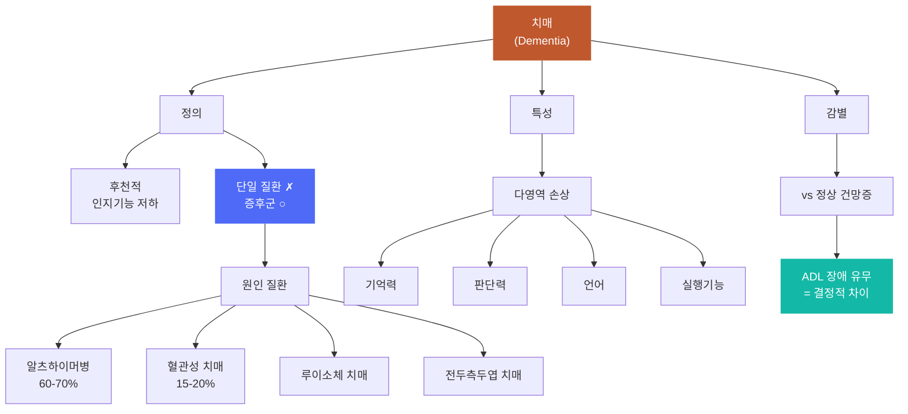
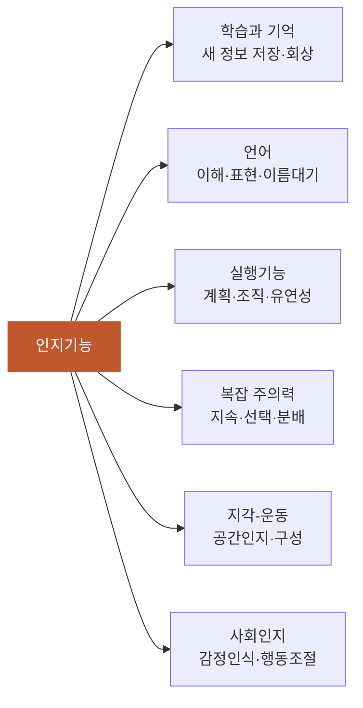
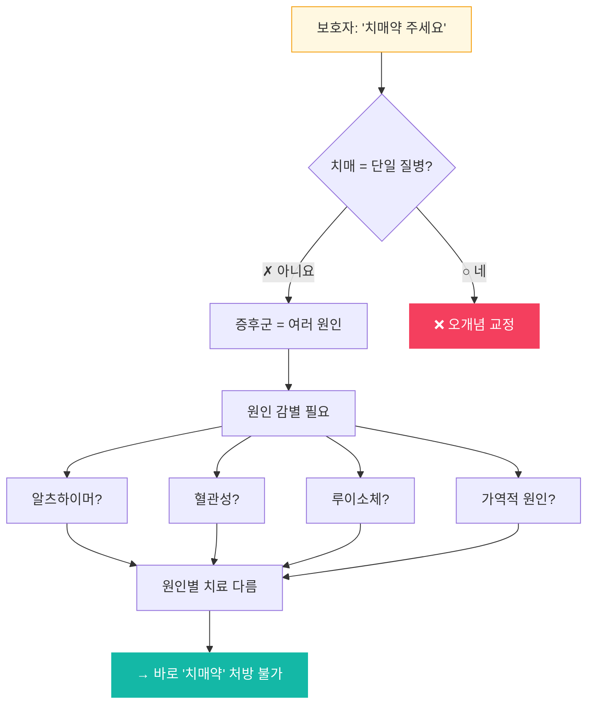

# 치매_개요

## 핵심 내용

치매(dementia)는 라틴어 "de(out of) + mens(mind) + ia(state of)"에서 유래하여 '정신이 없어진 상태'를 뜻한다. 1906년 알로이스 알츠하이머가 51세 여성 환자의 뇌 부검에서 특징적 병변을 발견하였고, 이후 현대적 치매 개념이 정립되었다. 2013년 DSM-5에서는 '주요신경인지장애(Major Neurocognitive Disorder)'로 공식 변경하였으나, 임상에서는 '치매'가 여전히 사용된다.

### 현대적 정의

치매는 **후천적으로** 인지기능(기억력, 판단력, 언어능력, 실행기능 등)이 지속적으로 저하되어 **일상생활에 장애**를 초래하는 **증후군**이다. 단일 질환이 아니라 다양한 원인 질환에 의해 발생하며, 원인 질환은 80~90가지에 이른다.

치매 진단의 핵심 3요소:

| 요소 | 내용 |
|-----|------|
| 인지기능 저하 | 이전 수준에 비해 유의미한 인지기능의 감퇴 |
| 일상생활 장애 | 인지 저하로 인해 독립적 일상생활 수행이 어려움 |
| 후천적 발생 | 선천적 지적장애와 구별, 이전에는 정상 기능이었음 |

### DSM-5 진단기준

A. 하나 이상의 인지 영역에서 이전 수행 수준에 비해 유의한 인지 저하
B. 인지 결함이 일상활동의 독립성을 방해
C. 섬망의 맥락에서만 발생하는 것이 아님
D. 다른 정신질환으로 더 잘 설명되지 않음

### 유병률

2019년 기준 우리나라 65세 이상 치매 유병률 10.29% (약 79만 명). 여성 62.9%. 65세 이상에서 5세 경과마다 유병률 약 2배 증가. 2050년 300만 명 초과 예상.

### 원인 질환 분포

| 원인 질환 | 비율 |
|---------|:---:|
| 알츠하이머병 | 60~75% |
| 혈관성 치매 | 15~20% |
| 루이소체 치매 | ~5% |
| 전두측두엽 치매 | ~5% |
| 기타 | ~5% |

### 6대 인지영역 (DSM-5)

**학습과 기억** — 새로운 정보의 등록·저장·인출. 알츠하이머병에서 가장 먼저 저하. 최근 기억이 먼저 손상.

**언어** — 표현(말하기, 쓰기)과 수용(이해, 읽기). 초기에 이름대기 어려움(anomia), 진행 시 함묵증.

**실행기능** — 계획 수립, 의사결정, 유연한 전환. 전두엽(배외측전전두엽) 관련. 손상 시 요리 순서를 못 따르거나 돈 관리 불가.

**복잡 주의력** — 지속·분할·선택적 주의력. 초기부터 여러 자극을 동시에 처리하는 능력 저하.

**지각-운동** — 시공간 능력, 구성 능력. 길 찾기 어려움, 화장실 위치를 모름, 가족 얼굴 인식 못함.

**사회인지** — 감정 인식, 마음 이론. 전두측두엽 치매에서 초기부터 저하. 공감능력 상실, 부적절한 행동.

### 정상 노화와의 감별

| 항목 | 정상 노화 | 치매 |
|-----|---------|------|
| 기억력 | 때때로 물건 둔 곳 잊음 | 자주 잃어버리고 찾지 못함 |
| 언어 | 간헐적 단어 찾기 어려움 | 대화 유지 어려움 |
| 판단력 | 가끔 나쁜 결정 | 심각하게 손상 |
| 일상생활 | 독립적 수행 가능 | 도움 필요 |
| 병식 | 변화 인지 | 인지 못하거나 부정 |

---

## 체크리스트

□ C1: 치매의 정의 — 후천적으로 인지기능이 저하된 상태, "이전에 정상이었다가 나빠진 것"을 구별해서 설명
□ C2: 다영역 손상 — 기억력만이 아닌 다영역 손상, 판단력·언어·실행기능 중 최소 2개를 구체적으로 언급
□ C3: ADL 장애 — 일상생활 장애가 건망증과의 결정적 차이, 사례로 건망증 vs 치매를 구분해서 설명
□ C4: 증후군 — 단일 질병이 아니라 다양한 원인에 의한 증후군, 원인 질환 최소 1개 예시
□ C5: 임상 적용 — "이 환자가 치매인가?"에 C1~C4 근거를 들어 판별하고 설명

체크 규칙:
- 학습자가 해당 개념을 "자기 말로" 표현하면 체크
- 교재 문장을 그대로 반복하는 것은 체크 안 함
- 한 턴에 여러 항목이 동시에 체크될 수 있음

---

## 교수 전략

### PS-I 첫 사례

> 73세 박할머니. 가족이 "요즘 약 먹는 걸 자꾸 잊고, 예전에 잘하던 된장찌개도
> 간을 못 맞춘다"고 호소. 며느리: "어제는 화장실 위치를 못 찾아서 거실에서
> 서성거렸어요. 치매약 좀 주세요."

이 사례를 제시하고 학습자에게 물어보세요:
- "이 할머니가 정말 치매일까요? 어떻게 판단하시겠어요?"

### 체크리스트별 교수 힌트

**C1 (정의) 유도:**
- "약 먹는 걸 잊는 건 나이 들면 누구나 그런데, 이게 왜 '치매'라고 하는 걸까요?"

**C2 (다영역) 유도:**
- "기억력만 문제인가요? 사례를 다시 보세요 — 된장찌개, 화장실 위치..."

**C3 (ADL) 유도:**
- "깜빡하고 약을 안 먹은 것 vs 혼자서 약을 챙길 수 없는 것, 뭐가 다를까요?"

**C4 (증후군) 유도:**
- "며느리가 '치매약 주세요'라고 했는데, 바로 줄 수 있을까요?"

**C5 (임상 적용):**
- C1~C4를 배운 후: "그럼 이 할머니 사례를 다시 보고, 치매인지 아닌지 판단해보세요."

---

## 자료

### 개념도: 치매의 구조



> C4(증후군) 설명 시 활용 — "이 그림에서 치매가 왜 '증후군'인지 보이나요?"

### 분류도: 6대 인지영역



> C2(다영역 손상) 탐색 시 — "기억력 말고 또 어떤 영역이 있을까요?"

### 비교표: 건망증 vs 치매

```clinical
건망증과 치매의 핵심 감별점

| 구분 | 건망증 | 치매 |
|------|--------|------|
| 원인 | 노화 (정상) | 뇌 질환 |
| 힌트 제공 시 | 기억 회복 ○ | 회복 불가 |
| 일상생활 | 지장 없음 | **ADL 장애** |
| 진행 | 안정적 | 점진적 악화 |

→ **ADL 장애**가 감별의 결정적 기준
```

### 흐름도: "치매약 주세요" 대응



> C5(임상 적용) — 이 흐름을 학습자가 스스로 설명할 수 있으면 완료

### 참고 카드

```tip
치매 진단의 핵심 3요소를 기억하세요:
1. **인지기능 저하** (이전보다 떨어짐)
2. **일상생활 장애** (독립적 수행 불가)
3. **후천적 발생** (원래는 정상이었음)
이 3가지가 전부 있어야 치매입니다.
```

```clinical
환자 가족이 "치매약 주세요"라고 하면:
→ "치매는 하나의 병이 아닙니다"부터 설명
→ 원인 질환 감별이 먼저 (알츠하이머? 혈관성? 기타?)
→ 원인에 따라 약이 다름
→ 바로 처방할 수 없는 이유를 가족에게 설명
```