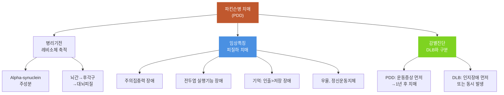

# 파킨슨병_치매

## 핵심 내용

# 파킨슨병 치매 (Parkinson's Disease Dementia)

## 핵심 개념

## 5. 파킨슨병 치매 (Parkinson's Disease Dementia, PDD)

### 5-1. 개요

파킨슨병 환자의 30~40%에서 치매가 동반되며, 10년 경과 시 대부분 치매 증상이 나타난다. 레비소체가 주된 병리소견이며, alpha-synuclein이 주성분이다.

Braak 등(2003)에 따르면, 운동증상이 나타나기 전부터 뇌간과 후각구(olfactory bulb)에 레비소체가 축적되기 시작한다. 이는 후각 기능 저하가 치매의 전조 증상이 될 수 있음을 시사한다.

### 5-2. 임상적 특징

## 5. 파킨슨병 치매 (Parkinson's Disease Dementia, PDD)

### 5-1. 개요

파킨슨병 환자의 30~40%에서 치매가 동반되며, 10년 경과 시 대부분 치매 증상이 나타난다. 레비소체가 주된 병리소견이며, alpha-synuclein이 주성분이다.

Braak 등(2003)에 따르면, 운동증상이 나타나기 전부터 뇌간과 후각구(olfactory bulb)에 레비소체가 축적되기 시작한다. 이는 후각 기능 저하가 치매의 전조 증상이 될 수 있음을 시사한다.

### 5-2. 임상적 특징

파킨슨병 치매는 피질하 치매(subcortical dementia)의 특성을 보인다:
- 주의집중력 장애, 전두엽 실행기능 장애, 시공간능력 장애
- 우울감, 정신운동지체(psychomotor retardation) 두드러짐
- 기억 장애는 비교적 경미 (정보 저장보다 인출 단계에서 이상)
- 정보를 단서(cue)와 함께 제시하면 회상이 개선됨

### 5-3. DLB와 PDD의 감별

DLB와 PDD는 모두 레비소체 병리를 공유하지만, 구별 기준은 운동증상과 치매의 발생 순서이다:
- DLB: 인지장애가 먼저 또는 운동증상과 동시에 발생
- PDD: 파킨슨 운동증상이 먼저, 치매는 1년 이상 후에 발생 (1년 규칙)

-----

## 6. 기타 치매 원인 질환

### 6-1. 가역적 원인

치매 증상을 일으키지만 원인을 치료하면 인지기능이 회복될 수 있는 질환들이 있다. 이들을 반드시 감별해야 한다:
- 갑상선기능저하증
- 비타민 B12 결핍
- 엽산 결핍
- 정상압 수두증(normal pressure hydrocephalus)
- 우울증에 의한 가성치매(pseudodementia)
- 약물 부작용에 의한 인지 저하

### 6-2. 기타 퇴행성 원인

- 크로이츠펠트-야콥병(CJD): 빠른 진행(수개월), 미오클로누스, 특징적 EEG
- 헌팅턴병: 상염색체 우성 유전, 무도증(chorea) + 치매
- 진행핵상마비(PSP): 수직 안구운동 마비, 축성 경직, 낙상
- 알코올성 치매: 장기 음주력, 영양결핍(티아민) 관련

-----

## 핵심 키워드

알츠하이머병, Alzheimer's disease, NIA-AA, IWG-2, 노인반, amyloid plaque, NFT, 혈관성 치매, vascular dementia, Hachinski, 계단식 악화, 혼합형 치매, mixed dementia, 루이소체 치매, DLB, Lewy body, alpha-synuclein, 환시, 인지변동, 신경이완제 과민반응, 전두측두엽 치매, FTD, bvFTD, 의미치매, 비유창실어증, 파킨슨병 치매, PDD, 피질하 치매, 가역적 치매

## 핵심 키워드

파킨슨병, 치매, 파킨슨병 치매, Parkinson's Disease Dementia


# 파킨슨병 치매 (PDD) 간호 교육용 통합 학습 파일

## 체크리스트

□ C1: PDD 정의와 유병률 특성 설명
□ C2: 피질하 치매 증상 특징 기술  
□ C3: DLB와 PDD 감별점 구분
□ C4: 레비소체 병리기전과 진행과정
□ C5: 임상 적용 — "이 환자에게 위 개념을 적용하여 판단/설명"

체크 규칙:
- 학습자가 해당 개념을 "자기 말로" 표현하면 체크
- 교재 문장을 그대로 반복하는 것은 체크 안 함
- 한 턴에 여러 항목이 동시에 체크될 수 있음

## 교수 전략

### PS-I 첫 사례

> 김철수(73세) 환자는 5년 전 파킨슨병 진단을 받고 치료 중이었습니다. 최근 3개월간 집중력 저하, 약속을 자주 잊어버림, 시계 보기 어려움을 호소합니다. 가족은 "기억은 힌트를 주면 생각해내는데, 멍하니 있는 시간이 많아졌다"고 말합니다. 우울해하며 동작이 더욱 느려진 상태입니다.

이 사례를 제시하고 학습자에게 물어보세요:
- "이 환자에게 나타나고 있는 인지 변화를 어떻게 설명할 수 있을까요?"

### 체크리스트별 교수 힌트

**C1 유도:**
- "파킨슨병 환자에서 치매가 발생하는 비율과 시기는 어떻게 될까요?"

**C2 유도:**
- "김철수 환자의 인지 증상들이 알츠하이머 치매와 어떤 차이를 보이는지 설명해보세요"

**C3 유도:**
- "운동 증상이 5년 전에 먼저 나타났다는 점이 진단에 어떤 의미가 있을까요?"

**C4 유도:**
- "파킨슨병에서 치매가 발생하는 병리학적 기전과 진행 과정을 설명해보세요"

**C5 (임상 적용):**
- C1~C4를 배운 후: "김철수 환자의 상태를 종합하여 간호 계획을 세운다면 어떤 점들을 고려해야 할까요?"

## 자료



```tip
파킨슨병 환자의 30-40%에서 치매 동반, 10년 경과 시 대부분 발생합니다.
피질하 치매 특성으로 주의력·실행기능 장애가 주요하며, 기억은 단서 제공 시 개선됩니다.
DLB와 달리 운동증상이 먼저 나타나고 1년 이상 후 치매가 발생하는 것이 감별점입니다.
```
