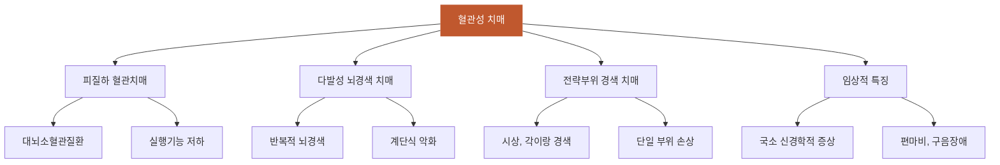

# 혈관성_치매

## 핵심 내용

# 혈관성 치매 (Vascular Dementia)

## 핵심 개념

## 2. 혈관성 치매 (Vascular Dementia)

### 2-1. 개요

뇌졸중의 반복으로 뇌 손상이 축적되어 발생하는 치매로, 전체 치매의 약 15~20%를 차지한다. 동양권(한국, 일본)에서 상대적으로 높은 비중을 보인다. 알츠하이머병과 달리 혈관 위험인자 관리를 통해 예방과 진행 억제가 가능하다는 점이 중요하다.

### 2-2. 분류

| 유형 | 특징 |
|-----|------|

## 2. 혈관성 치매 (Vascular Dementia)

### 2-1. 개요

뇌졸중의 반복으로 뇌 손상이 축적되어 발생하는 치매로, 전체 치매의 약 15~20%를 차지한다. 동양권(한국, 일본)에서 상대적으로 높은 비중을 보인다. 알츠하이머병과 달리 혈관 위험인자 관리를 통해 예방과 진행 억제가 가능하다는 점이 중요하다.

### 2-2. 분류

| 유형 | 특징 |
|-----|------|
| 피질하 혈관치매 | 대뇌소혈관질환에 의한 것으로 가장 흔함. 실행기능 저하가 두드러짐 |
| 다발성 뇌경색 치매 | 반복적 뇌경색으로 인한 인지기능 저하. 계단식 악화 |
| 전략부위 경색 치매 | 시상, 각이랑 등 핵심 부위의 단일 경색으로 인지장애 발생 |

### 2-3. 임상적 특징

혈관성 치매의 특징적 양상은 다음과 같다:
- 계단식 악화(stepwise deterioration): 뇌졸중 에피소드 후 급격한 악화 → 안정기 → 재악화
- 국소 신경학적 증상: 편마비, 구음장애, 초기 언어장애
- 실행기능 저하가 기억장애보다 두드러질 수 있음
- Hachinski 허혈점수(Hachinski's ischemia scale)로 혈관성 요소를 평가

### 2-4. 혼합형 치매 (Mixed Dementia)

## 핵심 키워드

혈관성, 치매, 혈관성 치매, Vascular Dementia


# 혈관성 치매 간호 교육용 통합 학습 파일

## 체크리스트

□ C1: 혈관성 치매의 정의와 발생 기전
□ C2: 혈관성 치매의 임상적 특징
□ C3: 알츠하이머병과 혈관성 치매의 차이점
□ C4: 혈관성 치매의 분류 및 유형별 특징
□ C5: 임상 적용 — "이 환자에게 위 개념을 적용하여 판단/설명"

체크 규칙:
- 학습자가 해당 개념을 "자기 말로" 표현하면 체크
- 교재 문장을 그대로 반복하는 것은 체크 안 함
- 한 턴에 여러 항목이 동시에 체크될 수 있음

## 교수 전략

### PS-I 첫 사례

> 김○○(78세) 남성이 가족과 함께 신경과 외래를 방문했습니다. 가족은 "할아버지가 6개월 전 뇌졸중을 앓은 후 갑자기 말이 어눌해지고 기억력이 떨어졌어요. 그런데 어떤 날은 괜찮다가도 며칠 전 또 작은 뇌경색이 와서 갑자기 더 심해졌습니다. 오른쪽 팔다리 힘도 약해지고 혼자서는 아무것도 못해요"라고 호소합니다.

이 사례를 제시하고 학습자에게 물어보세요:
- "이 환자의 인지기능 저하 양상에서 어떤 특징을 발견할 수 있나요?"

### 체크리스트별 교수 힌트

**C1 유도:**
- "혈관성 치매가 발생하는 원리를 뇌혈관과 연관지어 설명해보세요"
- "왜 동양권에서 혈관성 치매가 상대적으로 많이 발생한다고 생각하나요?"

**C2 유도:**
- "혈관성 치매 환자의 증상 진행 패턴은 어떤 특징이 있나요?"
- "이 환자에서 나타나는 국소 신경학적 증상은 무엇인가요?"

**C3 유도:**
- "알츠하이머병과 혈관성 치매의 진행 양상은 어떻게 다른가요?"
- "두 질환에서 예방 가능성의 차이는 무엇인가요?"

**C4 유도:**
- "혈관성 치매의 주요 세 가지 유형과 각각의 특징을 설명해보세요"
- "이 환자는 어떤 유형의 혈관성 치매로 보이나요?"

**C5 (임상 적용):**
- C1~C4를 배운 후: "이 환자의 치매 진행을 늦추기 위해 간호사로서 어떤 교육과 관리를 제공하겠습니까?"

## 자료



```tip
혈관성 치매는 뇌졸중의 반복으로 발생하는 치매로 계단식 악화 양상을 보입니다.
알츠하이머병과 달리 혈관 위험인자 관리를 통해 예방과 진행 억제가 가능합니다.
국소 신경학적 증상과 실행기능 저하가 초기 기억장애보다 두드러질 수 있습니다.
```
