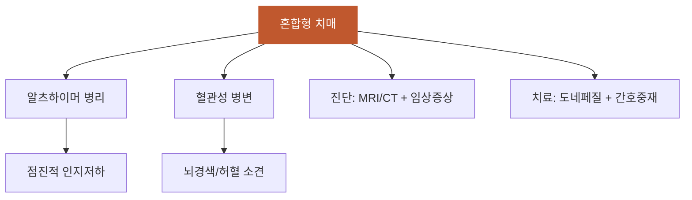

# 혼합형_치매

## 핵심 내용

# 혼합형 치매 (Mixed Dementia)

## 핵심 개념

노인의 뇌에서는 혈관성 병변과 알츠하이머 병리가 공존하는 경우가 흔하다. MRI/CT에서 뇌혈관 질환 소견이 확인되면서 점진적 인지기능 저하도 동반될 때 혼합형 치매를 진단한다.

케이스 예시(Mr Ho, 78세): 뇌졸중 병력, MMSE 14/30, CT에서 과경색 및 만성 허혈 소견 → 알츠하이머 + 혈관성 혼합형 치매 진단, 도네페질 5mg + 주간보호 서비스

-----

## 핵심 키워드

혼합형, 치매, 혼합형 치매, Mixed Dementia


# 혼합형 치매 통합 학습 파일

## 체크리스트

□ C1: 혼합형 치매의 정의와 특징
□ C2: 혼합형 치매의 진단 기준
□ C3: 단일형 치매와 혼합형 치매의 차이점
□ C4: 혼합형 치매의 발생 기전과 병리적 특성
□ C5: 임상 적용 — "이 환자에게 위 개념을 적용하여 혼합형 치매 간호계획 수립"

체크 규칙:
- 학습자가 해당 개념을 "자기 말로" 표현하면 체크
- 교재 문장을 그대로 반복하는 것은 체크 안 함
- 한 턴에 여러 항목이 동시에 체크될 수 있음

## 교수 전략

### PS-I 첫 사례

> 김○○님(82세, 여성)이 가족과 함께 외래를 방문했습니다. 3년 전 뇌경색으로 입원 치료받은 병력이 있으며, 최근 2년간 기억력 저하가 점차 심해지고 있다고 합니다. 며느리는 "처음엔 중풍 때문인 줄 알았는데, 요즘은 손자 이름도 헷갈려 하세요"라고 호소했습니다. MMSE 점수는 16/30점이며, 뇌 CT에서 다발성 소경색과 뇌실 주위 백질 변성 소견이 관찰되었습니다.

이 사례를 제시하고 학습자에게 물어보세요:
- "이 환자의 인지기능 저하 원인을 어떻게 설명할 수 있을까요?"

### 체크리스트별 교수 힌트

**C1 유도:**
- "혼합형 치매란 무엇이며, 어떤 특징을 가지고 있나요?"

**C2 유도:**
- "혼합형 치매는 어떤 근거로 진단할 수 있나요?"

**C3 유도:**
- "알츠하이머 치매나 혈관성 치매와는 어떤 차이점이 있을까요?"

**C4 유도:**
- "노인에게서 혼합형 치매가 발생하는 이유는 무엇일까요?"

**C5 (임상 적용):**
- C1~C4를 배운 후: "김○○님께 어떤 치료적 접근과 간호중재를 계획하시겠습니까?"

## 자료



```tip
혼합형 치매는 노인에서 알츠하이머와 혈관성 병변이 동시에 나타나는 상태입니다.
영상검사에서 뇌혈관 질환 소견과 함께 점진적 인지기능 저하가 핵심 진단 기준입니다.
포괄적 치료 접근(약물치료 + 사회적 지지)이 환자 삶의 질 향상에 중요합니다.
```
